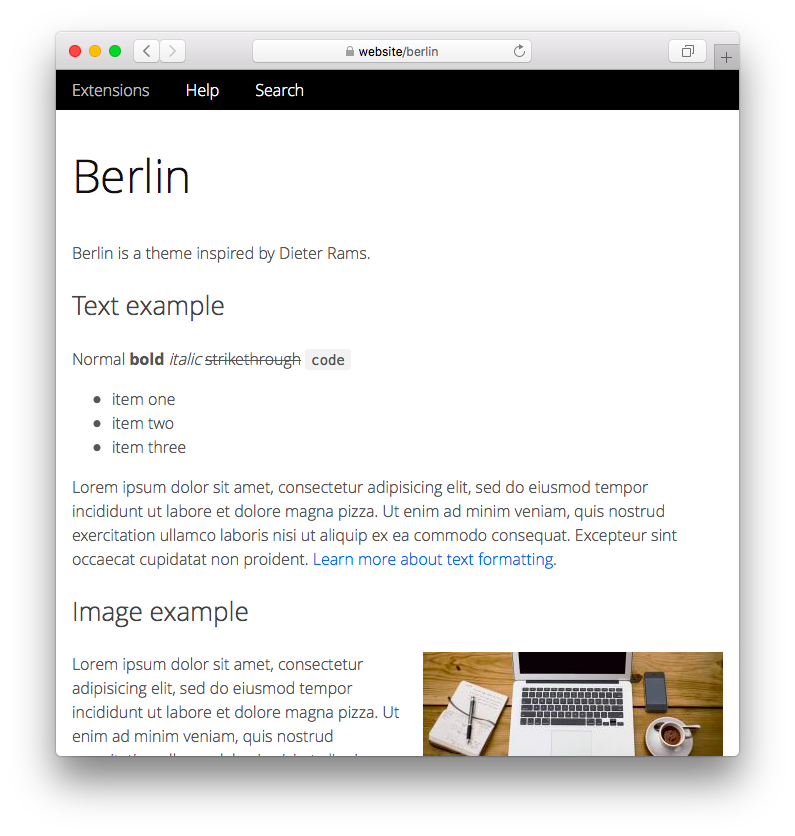

<a href="README-de.md">Deutsch</a> &nbsp; <a href="README.md">English</a> &nbsp; <a href="README-sv.md">Svenska</a>

# Berlin 0.9.5

Berlin ist ein Theme inspiriert von Dieter Rams.

## Wie man eine Erweiterung installiert

[ZIP-Datei herunterladen](https://github.com/annaesvensson/yellow-berlin/archive/refs/heads/main.zip) und in dein `system/extensions`-Verzeichnis kopieren. [Weitere Informationen zu Erweiterungen](https://github.com/annaesvensson/yellow-update/tree/main/README-de.md).

## Wie man ein Theme anpasst

Du kannst das Aussehen deiner Webseite mit HTML und CSS anpassen. Alle HTML-Dateien befinden sich im `system/layouts`-Verzeichnis. Alle CSS-Dateien befinden sich im `system/themes`-Verzeichnis. Du kannst diese Dateien beliebig ändern und auch deine eigenen Dateien hinzufügen. Deine Änderungen werden bei der Aktualisierung der Webseite nicht überschrieben. [Weitere Informationen zu Themes](https://datenstrom.se/de/yellow/help/how-to-customise-a-theme).

Das Standard-Theme wird in der Datei `system/extensions/yellow-system.ini` festgelegt. Ein anderes Theme lässt sich in den [Seiteneinstellungen](https://github.com/annaesvensson/yellow-core/tree/main/README-de.md#einstellungen-seite) ganz oben auf jeder Seite festlegen, zum Beispiel `Theme: berlin`.

## Danksagung

Diese Erweiterung enthält Open Sans von Steve Matteson. Danke für die schöne Schriftart.

## Designer

Anna Svensson. [Hilfe finden](https://datenstrom.se/de/yellow/help/).
