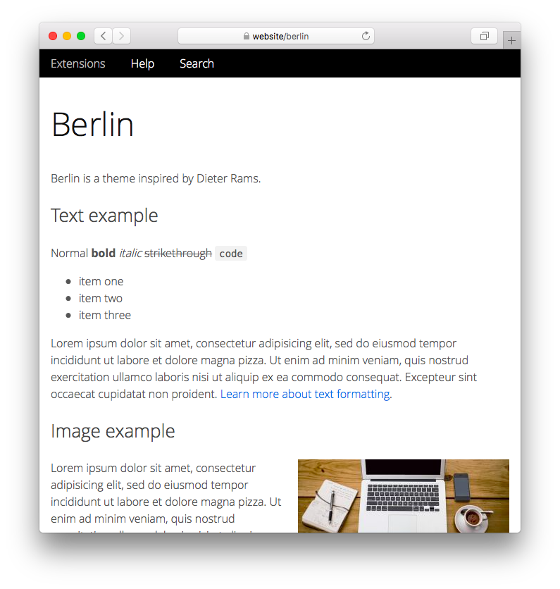

<a href="README-de.md">Deutsch</a> &nbsp; <a href="README.md">English</a> &nbsp; <a href="README-sv.md">Svenska</a>

# Berlin 0.9.2

Berlin är ett tema inspirerat av Dieter Rams.

## Hur man installerar ett tillägg

[Ladda ner ZIP-filen](https://github.com/annaesvensson/yellow-berlin/archive/refs/heads/main.zip) och kopiera den till din `system/extensions` mapp. [Läs mer om tillägg](https://github.com/annaesvensson/yellow-update/tree/main/README-sv.md).

## Hur man anpassar ett tema

Alla temafiler finns i `system/themes` mappen. Alla layoutfiler finns i `system/layouts` mappen. Du kan redigera dessa filer. Dina ändringar kommer inte att skrivas över när webbplatsen uppdateras.

Standardtemat definieras i filen `system/extensions/yellow-system.ini`. Ett annat tema kan definieras i [sidinställningarna](https://github.com/annaesvensson/yellow-core/tree/main/README-sv.md#inställningar-page) högst upp på varje sida, till exempel `Theme: berlin`. [Läs mer om teman](https://datenstrom.se/sv/yellow/help/how-to-customise-a-theme).

## Tack

Detta tillägg innehåller Open Sans av Steve Matteson. Tack för det vackra typsnittet.

## Formgivare

Anna Svensson. [Få hjälp](https://datenstrom.se/sv/yellow/help/).
